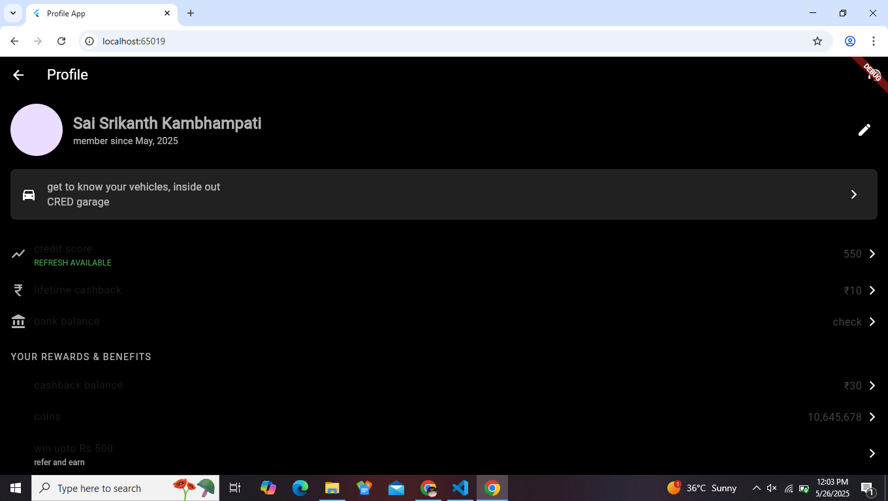

# Profile App

A Flutter-based mobile application that displays a user profile screen with dynamic data, similar to a rewards and credit score tracking app. This app features a dark-themed UI with sections for user details, credit score, cashback, coins, and more.

## Features

- Displays user profile information (name, member since date, etc.).
- Shows dynamic data such as credit score, lifetime cashback, and coins.
- Includes sections for rewards, benefits, and transactions.
- Dark-themed UI inspired by modern financial apps.
- Built with Flutter for cross-platform compatibility (Android & iOS).

## Screenshots

Below are some screenshots of the app in action:


*Screenshot of the Profile Screen showing user details, credit score, and rewards.*


*Screenshot highlighting the Rewards & Benefits section with cashback and coins.*

## Prerequisites

To run this project, you need the following installed on your system:

- [Flutter](https://flutter.dev/docs/get-started/install) (latest stable version)
- [Dart](https://dart.dev/get-dart) (comes with Flutter)
- An IDE like [VS Code](https://code.visualstudio.com/) or [Android Studio](https://developer.android.com/studio)
- An emulator or physical device for testing

## Setup Instructions

1. **Clone the Repository**:
   ```bash
   git clone https://github.com/Sai-Srikanth27/cred_profile_ui-
   cd cred_profile_ui-
